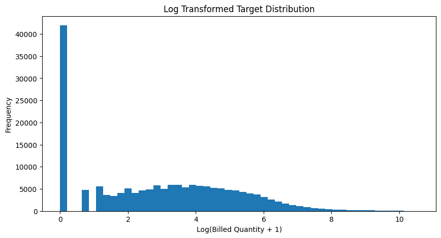
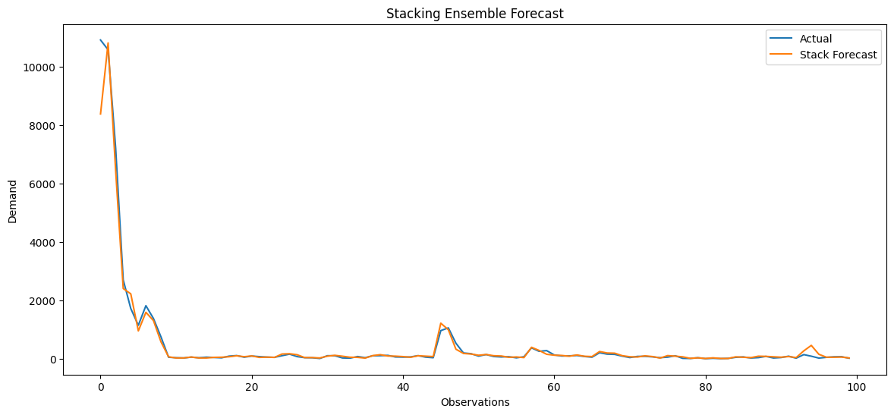

# 📈 Demand Forecasting using Ensemble Machine Learning & Stacking

---

# 📌 Project Overview

This project implements an end-to-end demand forecasting pipeline using multiple machine learning models and stacking ensemble techniques.

The objective of the project is to forecast future billed quantities for high-demand products using historical sales behavior, engineered lag features, rolling statistical indicators, and ensemble learning methods.

The project focuses specifically on forecasting high-demand `RUNNER` category products across multiple regions.

---

# 🎯 Problem Statement

Accurate demand forecasting is critical for:

- inventory optimization
- supply chain planning
- stock availability
- production scheduling
- demand sensing

Traditional forecasting models often struggle with:

- highly skewed demand distributions
- intermittent demand behavior
- nonlinear sales patterns
- varying demand volumes across products

This project addresses these challenges using:

- ensemble machine learning models
- Out-of-Time forecasting validation
- stacking ensemble learning
- hyperparameter tuning

---

# 📂 Dataset Information

The dataset contains:

- product-region level demand information
- historical billed quantities
- engineered lag features
- rolling statistical features
- momentum and trend indicators
- demand stability metrics

The forecasting target used in this project is:

```python
BilledQuantity_lead1
```

which represents future demand forecasting.

---

## 📉 Log Transformed Target Distribution

The target variable was log transformed to stabilize skewed demand behavior and improve forecasting model learning.



# ⚙️ Engineered Features Used

The dataset already contained engineered forecasting features such as:

## 🔁 Lag Features

- `BilledQuantity_lag0`
- `BilledQuantity_lag1`
- `BilledQuantity_lag2`

## 📊 Rolling Statistical Features

- `roll_mean_3`
- `roll_std_3`
- `cv_3`

## 📈 Trend & Momentum Features

- `momentum`
- `trend_idx`

## 📦 Demand Stability Features

- `stock_cover`
- `zero_flag`
- `zero_rate_6`

## 📅 Time Features

- `Month`
- `Year`
- `SalesMonth`

---

# 🏷️ Product Filtering

The dataset was specifically filtered for:

```python
Category == 'RUNNER'
```

Runner products represent high-demand and frequently sold products, making them highly relevant for demand forecasting and inventory planning.

---

# 🤖 Forecasting Models Used

The following models were initially trained and evaluated:

1. XGBoost Regressor
2. Random Forest Regressor
3. LightGBM Regressor
4. Decision Tree Regressor
5. Ridge Regression

---

# 🛠️ Hyperparameter Tuning

Hyperparameter tuning was performed using:

```python
RandomizedSearchCV
```

for:

- XGBoost
- Random Forest
- LightGBM

The best parameters obtained from tuning were used for final model training.

---

# 📏 Evaluation Metrics

The forecasting models were evaluated using:

- SMAPE (Symmetric Mean Absolute Percentage Error)
- RMSE (Root Mean Squared Error)
- WAPE (Weighted Absolute Percentage Error)

---

# 🕒 Out-of-Time (OOT) Validation

A time-series aware Out-of-Time validation strategy was used.

## 📆 OOT Months

- Oct 2025
- Nov 2025
- Dec 2025
- Jan 2026
- Feb 2026
- Mar 2026

---

# 🧠 Stacking Ensemble

The final ensemble model combined predictions from:

- XGBoost
- Random Forest
- LightGBM

A `RandomForestRegressor` was used as the stacking meta-model.

## 📈 Stacking Ensemble Forecast Visualization

Comparison between actual demand and stacking ensemble predictions.



## 🔀 Stacking Strategy

| Usage | Months |
|---|---|
| Stack Training | Oct 2025 → Dec 2025 |
| Final Forecasting | Jan 2026 → Mar 2026 |

---

# 🏆 Model Selection Decision

After model comparison:

## ✅ Final Selected Models

- XGBoost
- Random Forest
- LightGBM

## ❌ Removed Models

- Decision Tree
- Ridge Regression

These models showed comparatively weaker forecasting performance and higher forecasting errors.

---
## 📊 Forecasting Model Comparison

The following graph compares the forecasting performance of all trained machine learning models using Average SMAPE.


# 🎯 High Accuracy Forecast Analysis

Separate analysis was performed for forecasts with:    

```python
SMAPE < 20%
```

to identify:

- highly reliable forecasts
- stable demand patterns
- high-confidence predictions

---

# 📊 Visualizations Included

The notebook includes:

- target distribution analysis
- monthly demand trend visualization
- model comparison charts
- actual vs predicted plots
- stacking forecast visualization
- high accuracy forecast analysis

---

# 🗂️ Project Structure

```text
├── data/
├── notebooks/
│   └── demand_forecasting.ipynb
├── models/
│   ├── xgboost_model.pkl
│   ├── randomforest_model.pkl
│   ├── lightgbm_model.pkl
├── outputs/
│   ├── forecast_results.csv
│   ├── stacking_results.csv
├── README.md
```

---

# 🚀 Technologies Used

- Python
- Pandas
- NumPy
- Scikit-learn
- XGBoost
- LightGBM
- Matplotlib
- Joblib

---

# ✅ Conclusion

This project demonstrates a complete machine learning demand forecasting pipeline using ensemble learning and stacking techniques.

The workflow included:

- Out-of-Time forecasting
- lag and rolling statistical feature utilization
- hyperparameter tuning
- forecasting error analysis
- model comparison
- stacking ensemble forecasting

The forecasting models were evaluated using:

- SMAPE
- RMSE
- WAPE

Among the trained models:

- XGBoost
- Random Forest
- LightGBM

demonstrated comparatively stronger forecasting performance and were selected for the final stacking ensemble.

Decision Tree and Ridge Regression showed comparatively weaker forecasting performance and were excluded from the final ensemble pipeline.

A stacking ensemble using Random Forest as the meta-model was implemented to combine predictions from the best-performing models and improve forecasting stability.

The project also included:

- high-accuracy forecast filtering
- low SMAPE analysis
- Out-of-Time validation
- high-volume runner product forecasting

Overall, the final forecasting pipeline demonstrated effective demand prediction capability for high-demand product categories across multiple regions.

---

# 🔮 Future Improvements

Possible future enhancements include:

- separate forecasting pipelines for low-volume and high-volume products
- advanced time-series forecasting models
- probabilistic forecasting
- feature importance analysis
- deep learning based forecasting approaches
- automated retraining pipelines
- deployment using APIs or dashboards
- advanced time-series forecasting models
- probabilistic forecasting
- feature importance analysis
- deep learning based forecasting approaches
- automated retraining pipelines
- deployment using APIs or dashboards

- comparison.ong.png
Add files via upload
3 minutes ago
output.png
Add files via upload
3 minutes ago
output.png 1.png
Add files via upload
3 minutes ago
stacking_comparison.png
